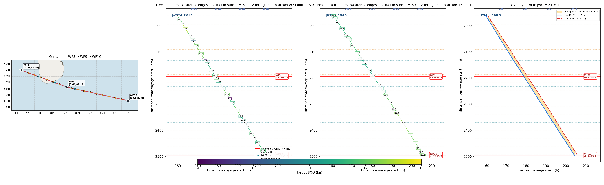

# Graph Rebuild — Summary (2026-05-06)

End-to-end summary of the rebuilt DP graph: frame, atomic-edge construction,
graph statistics, SR DP vs Luo DP results, and a per-window visualization
of the most divergent 3-waypoint slice.

Companion files:
- Code: `pipeline/dp_rebuild/{frame,build_atomic_edges,bellman_locked,run_demo_rebuild}.py`
- Analyzers: `pipeline/dp_rebuild/{analyze_overlap,trace_optimal,find_divergent_waypoints,visualize_schedules}.py`
- Logs: `pipeline/dp_rebuild/results/`
- Spec: `docs/meeting_prep_2026_05_11.md` §2

---

## 1. Frame creation

The frame is **pure (t, d) geometry + lookups** — it knows where the V-lines
and H-lines sit and how to snap to them, but it does **not** materialize any
graph nodes. Nodes appear only as a byproduct of the edge build.

### 1.1 Inputs

| | |
|---|---|
| `route` | YAML voyage definition (`weather_forecasts.yaml`) — segment lengths, β, ETA = 280 h. |
| `waypoints` | 13 paper waypoints (lat, lon, idx, β, segment length). |
| `voyage` | `VoyageWeather` HDF5 reader for cell-canonical weather. |
| `cfg` | `GraphConfig` (length_nm = 3393.24, eta_h = 280, dt_h = 6, ζ_nm = 1, τ_h = 0.1, v_min = 9, v_max = 13). |

### 1.2 What `frame.py` produces

| Field / method | What it returns | Source |
|---|---|---|
| `frame.v_line_times` | sorted list of V-line t-values | `v_line_times_from_route(cfg, route)` — `{k·6 h : k ≥ 1}` ∪ forecast boundaries ∪ ETA |
| `frame.h_line_distances` | sorted list of H-line d-values | `h_line_distances_from_geo(cfg, waypoints, grid_deg=0.5)` — analytic rhumb-vs-grid crossings ∪ paper-segment boundaries ∪ {L} ∪ τ-grid feasibility filter |
| `frame.sog_grid()` | discrete target-SOG grid | `[v_min, v_max]` at `sog_step = 0.1 kn` → 41 SOGs |
| `frame.next_v_time(t)` | next V-line strictly after `t` | binary search on `v_line_times` |
| `frame.next_h_distance(d)` | next H-line strictly after `d` | binary search on `h_line_distances` |
| `frame.snap_h_dst_t(t)` | snap arrival time to 0.1 h grid | `round(t / τ_h) · τ_h` |
| `frame.snap_v_dst_d(d)` | snap arrival distance to 1 nm grid | `round(d / ζ_nm) · ζ_nm` |
| `frame.cell_weather_at(d, sample_hour)` | cell-canonical weather (linear/circular mean) at distance d | `voyage.cell_weather_at_d(d, …)` |
| `frame.paper_heading_at(d)` | paper-segment β at distance d | `position_at_d(d, waypoints)` → segment.heading |
| `frame.block_index(t)` | which 6 h block t belongs to | `int(t // dt_h)` |
| `frame.sample_hour_for_block(t)` | block-start sample_hour for Luo 2024 | `int(round(block_start))` |

### 1.3 Frame on the YAML voyage

| Stat | Value |
|---|---:|
| L (rhumb total) | 3393.24 nm |
| ETA | 280.0 h |
| V-lines | **47** times (6, 12, …, 276, 280) |
| H-lines | **162** distances (cell crossings + segment boundaries + terminal at L; 2 dropped by τ-grid filter) |
| SOG grid | **41** target SOGs in [9.0, 13.0] kn at 0.1 kn step |
| Blocks | 46 full + 1 partial (block 46 spans [276, 280) = 4 h) |

---

## 2. Edge creation — 9 steps per atomic edge

Each emitted atomic edge is **one sub-arc through one cell at one target SOG**.
The builder iterates discovered nodes BFS-style from the source `(0, 0)`, and
for each one enumerates 41 atomic edges (one per target SOG).

### 2.1 The 9-step derivation

For each `(src_t, src_d, target_sog)` tuple:

| Step | Action | Notes |
|---|---|---|
| **1** | look up `next_v = frame.next_v_time(src_t)` and `next_h = frame.next_h_distance(src_d)` | both required to decide which line is crossed first |
| **2** | compute `Δt_to_h = (next_h − src_d) / target_sog` and `Δt_to_v = next_v − src_t` | times to reach each next line at `target_sog` |
| **3** | branch — H-line target if `Δt_to_h ≤ Δt_to_v`, else V-line target | "first boundary crossed" rule (matches Q1 in the paper) |
| **4** | snap arrival to grid: 0.1 h on H-line, 1 nm on V-line | adjusts trajectory landing to the discrete graph |
| **5** | compute realized SOG = `Δd / Δt` after snap | post-snap drift (typically ±0.5 kn) |
| **6** | look up cell-canonical weather + paper β at `src_d`, with `sample_hour = block-start` | physics inputs for this sub-arc |
| **7** | inverse-solve `SWS = inverse_solve(realized_sog, weather, β)` | engine speed needed to make the realized SOG good |
| **8** | compute `FCR = 0.000706 · SWS³` | the cubic FCR ≈ SWS relationship |
| **9** | compute `fuel = FCR · Δt`; emit `AtomicEdge(src, dst, target_sog, sog=realized, sws, fcr, fuel, weather, β)` | one fuel scalar per edge — Bellman accumulates `Σ fuel` along paths |

### 2.2 Worked example (first edge of the optimal schedule)

`src = (0.000 h, 0.000 nm), target_sog = 11.10 kn`

```
1. next_v = 6.000 h ;  next_h = 10.500 nm
2. Δt_h = 10.500 / 11.10 = 0.946 h ;  Δt_v = 6.000 h
3. H-line target (Δt_h ≤ Δt_v)
4. raw  dst_t = 0.946 h  →  snap to 0.1 h  →  dst_t = 0.900 h
5. realized SOG = 10.5 / 0.9 = 11.667 kn  (target 11.10 → realized 11.667, drift +0.567)
6. weather: wind 32.84 km/h, dir 322°, BN 5, wave 0.42 m, current 1.30 km/h ; β = 61.25°
7. SWS = inverse_solve(11.667, weather, β) = 12.024 kn
8. FCR = 0.000706 · 12.024³ = 1.227 mt/h
9. fuel = 1.227 · 0.900 = 1.105 mt
   → emit AtomicEdge((0,0) → (0.9, 10.5), target=11.10, fuel=1.1046 mt)
```

Full per-edge trace for the optimal schedule (201 edges):
`pipeline/dp_rebuild/results/optimal_schedule_trace_2026_05_06.txt`.

### 2.3 Per-block walkthrough

A 6 h block contains a **chain** of atomic edges: typically 1 V-line src edge,
some number of H-line src edges, and 1 V-line-terminator edge if the budget
runs out mid-cell. **All edges in a block read weather at the same
`sample_hour`** = block-start (Luo 2024 spec).

Block 1 trace (4 atomic edges, 7.714 mt total):
`pipeline/dp_rebuild/results/block1_trace_2026_05_06.txt`.

```
edge 1   src V-line (6.0, 72.27)   → H-line (7.7, 92.76)    target 11.80   fuel 2.2019
edge 2   src H-line (7.7, 92.76)   → H-line (8.5, 103.15)   target 12.30   fuel 1.2806
edge 3   src H-line (8.5, 103.15)  → H-line (11.0, 134.03)  target 12.20   fuel 3.1346
edge 4   src H-line (11.0, 134.03) → V-line (12.0, 146.00)  target 11.50   fuel 1.0971  (V-line terminator)
                                                                            block fuel = 7.7140 mt
```

The last edge is the V-line-terminator — at target 11.50 kn the trajectory
would reach the next H-line in 1.82 h, but only 1.0 h of block budget
remains, so the chain cuts at the V-line and snaps `dst_d` to 1 nm.

---

## 3. Graph statistics

### 3.1 The single rebuilt graph

| Stat | Value |
|---|---:|
| Source | `(0.0, 0.0)` |
| Sinks | every (V-line, d = L) |
| **Nodes (canonical)** | **91,663** |
| Nodes by line type | V = 20,936 ; H = 70,727 (line_type is best-effort — Bellman uses (t, d) only) |
| **Edges (atomic)** | **3,317,895** |
| Avg fan-out | 41.0 (one edge per target SOG, post-snap collisions kept) |
| Target SOG | 41 distinct values in [9.0, 13.0] kn |
| Realized SOG | [9.0001, 12.9997] kn (post-snap clamping) |
| SWS range | [8.32, 14.34] kn (mean 11.19) |
| Fuel per edge | [0.048, 5.215] mt (mean 1.633) |
| NaN edges | 0 |
| Build time | **72 s** (BFS + 41 × edge emission per node) |

### 3.2 Compared to May 4 build

| | May 4 build | Rebuild |
|---|---:|---:|
| Frame (V/H positions) | same | same |
| SR-DP nodes | 613,328 | **91,663** (lazy interning — only nodes reachable by some atomic edge) |
| SR-DP edges | 3,308,940 | (subsumed by atomic graph) |
| Locked-DP edges | 631,537 | (subsumed) |
| Combined edges | 3,940,477 | (no longer needed) |
| **Single atomic-edge graph** | n/a | **3,317,895** |
| Build time | ~230 s (free + locked) | **72 s** (one build) |

The rebuild has **6.7×** fewer nodes and the same effective edge count, with
both DP modes running on the same data. Memory and pipeline footprint shrink
correspondingly.

---

## 4. DP results — SR vs Luo

Both DPs run on the *same* atomic-edge graph. SR DP is plain forward
Bellman. Luo DP augments state with `(node, locked_sog)`: the SOG locked at
the V-line entering a block must match the `target_sog` of every atomic edge
inside that block; the lock resets at the next V-line.

### 4.1 Headline numbers (YAML voyage, ETA = 280 h, sample_hour = 0)

| Mode | Total fuel | Δ vs baseline | Δ vs May 4 |
|---|---:|---:|---:|
| Baseline (steady SOG = 12.119 kn) | 366.416 mt | — | −0.103 |
| **SR DP** | **365.809 mt** | **−0.606 mt** | **−0.960** vs May 4 free (366.769) |
| **Luo DP** (SOG-lock per 6 h) | **366.132 mt** | **−0.284 mt** | +0.971 vs May 4 locked (365.161) |
| Δ Luo − SR | +0.323 mt | — | Luo ≥ SR by construction ✓ |

| | |
|---|---:|
| Bellman states (SR) | 91,663 (one per canonical node) |
| Bellman states (Luo) | 1,862,370 ≈ node × lock |
| Distinct lock values | **41 / 41** (every SOG in the grid is reached as a lock somewhere) |
| Lock invariant in Luo schedule | **47/47** blocks have exactly one distinct `target_sog` ✓ |
| Solve times | SR 3.3 s · Luo 6.3 s |

### 4.2 Per-block overlap analysis

Each 6 h block in the optimal schedules is classified by how many distinct
`target_sog` values **SR DP** chose inside it (the analyzer is in
`analyze_overlap.py`):

| Type | Definition | Count |
|---|---|---:|
| **A** | SR voluntarily uses **1 SOG**, *same value* as Luo | **0** |
| **B** | SR voluntarily uses **1 SOG**, *different value* than Luo | **1** *(block 25)* |
| **C** | SR uses **≥ 2 SOGs** in the block | **46** |

So SR DP never converges on Luo's exact decision. 46/47 blocks SR wants
to vary SOG mid-block.

### 4.3 Aligned vs unaligned blocks (the surprising part)

A block is *aligned* when SR's and Luo's V-line `src_d` and `dst_d` coincide.

| | Aligned (✓) | Unaligned (≠) |
|---|---:|---:|
| Block count | 7 / 47 | 40 / 47 |
| Σ SR fuel | 54.042 mt | 311.767 mt |
| Σ Luo fuel | 54.042 mt | 312.090 mt |
| **Δfuel (Luo − SR)** | **+0.000 mt** | **+0.323 mt** |

In every aligned block — even the 7 type-C ones where SR uses up to 5
distinct target SOGs — the per-block fuel is **identical to the millimetre**.
Different target SOGs collapse to the same realized snap-grid trajectory once
`(src_d, dst_d)` are pinned.

### 4.4 Reframed conclusion

The +0.323 mt Luo penalty does **not** come from "SR changes SOG
mid-block, Luo can't". Aligned-block evidence shows mid-block flexibility
produces **zero** fuel saving when V-line node positions match.

The penalty comes from **V-line position choice**. Luo's lock indirectly
forces the schedule onto a less-flexible *trajectory* — different `dst_d` at
each 6 h V-line — and 40 of 47 blocks have unaligned boundaries. That's
where the gap accumulates.

Full block table: `pipeline/dp_rebuild/results/sr_vs_luo_overlap_2026_05_06.txt`.

---

## 5. Visualization — most divergent 3-waypoint window

To make the schedule difference visible, all 11 possible 3-waypoint windows
were ranked by area-between-trajectories (`find_divergent_waypoints.py`):

| Window | Δfuel local | area (nm·h) | max \|Δd\| |
|---|---:|---:|---:|
| **WP8 → WP10** | **−1.000** | **865** | **24.49** |
| WP9 → WP11 | +3.266 | 839 | 24.49 |
| WP7 → WP9 | −4.118 | 440 | 20.15 |
| WP10 → WP12 | +3.386 | 368 | 17.32 |

**WP8 → WP10** (d ∈ [1961, 2496] nm, t ∈ [156.5, 208.0] h) is the most
divergent slice. Notably, **Luo is locally cheaper by 1 mt** here even
though globally it loses 0.323 mt to SR — SR "spends" the local
inefficiency to gain more elsewhere.



The four panels show:
1. **Mercator chart** — rhumb-line segments WP8 → WP9 → WP10 with 0.5° NWP grid + lat/lon crossings.
2. **SR DP edges** in the (t, d) plane, colored by target SOG (viridis 9→13 kn). Each atomic edge is annotated with its target SOG. SR changes speed at almost every H-line crossing.
3. **Luo DP edges** in the (t, d) plane. Within each 6 h block all atomic edges share one target SOG (the lock value). Adjacent blocks may pick different locks, so colors change at V-line boundaries.
4. **Overlay** — SR (blue solid) and Luo (red dashed) trajectories on the same axes, with `fill_between` shading the divergence area (865 nm·h). Max \|Δd\| = 24.49 nm at peak.

### 5.1 What you can read off the plot

| Panel feature | Reading |
|---|---|
| Color of an atomic edge | the target SOG it was emitted with (the captain's decision; Luo's lock label) |
| White-bordered tag near edge midpoint | the same target SOG as a numeric value |
| SR panel — many color shifts in one block | Type-C block: SR DP changed speed at H-line crossings |
| Luo panel — uniform color in one block | lock invariant: one target SOG holds across the block |
| Overlay — yellow fill | divergence area between SR and Luo trajectories |
| Overlay — convergence at WP8/WP10 | both schedules pass through the same V-line node at segment endpoints |

To regenerate any window:

```bash
python3 pipeline/dp_rebuild/visualize_schedules.py 3 8     # WP8 → WP10 (default)
python3 pipeline/dp_rebuild/visualize_schedules.py 3 7     # WP7 → WP9
python3 pipeline/dp_rebuild/visualize_schedules.py 4 1     # WP1 → WP4 (matches paper figure)
```

---

## 6. Status & next steps

- ✅ Frame, atomic-edge builder, dual-mode Bellman (SR + Luo) all in place
  and producing apples-to-apples results on a single graph.
- ✅ Validated against May 4 numbers (small expected drift from V-line snap
  on Luo, +0.96 mt improvement on SR from cell-level branching).
- ✅ Visual + analytical evidence that the SR–Luo gap is about *V-line
  position selection*, not *mid-block speed flexibility* — paper-relevant
  finding.
- ⏳ Validators (`validate_graph.py`) not yet adapted to the rebuild graph.
- ⏳ Behavioural sanity checks (zero-weather, constant-weather,
  lock-monotonicity).
- ⏳ Rolling horizon — same atomic graph, replan every 6 h with fresh
  forecast.
- ⏳ Hourly weather data (per-block sample_hour) — current run uses
  `override_sample_hour=0` because the test HDF5 only covers hours 0–11.
