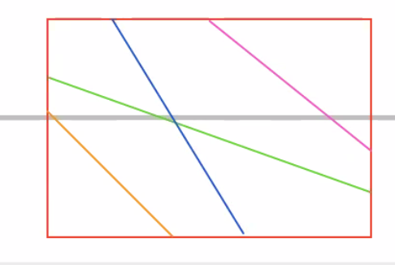

# Meeting Prep — Supervisor Meeting, June 29 2026

---

## 1. Action Items from June 15 Meeting

*(to fill in after the June 15 meeting)*

| # | Task | Status |
|---|------|--------|
| 1 | *(to fill in)* | not started |
| 2 | *(to fill in)* | not started |
| 3 | *(to fill in)* | not started |

### §4 reconciliation after Tal's revision (`301fc5b`, pulled 2026-06-28)

Tal rewrote §3's solution paragraph and the whole §4 intro + §4.1 (State space) in **new notation**, but left the old §4.2/§4.3 in place underneath — so §4 is currently a half-merge with two contradictory formulations. This re-scopes the items below.

**What Tal's edit resolved/changed:**
- SOG now has a symbol, `v(t)`, and there is a **discrete speed set `V`** (e.g. {10.0,…,18.5} kn) — §3, line 175.
- Discretisation units renamed: time → **blocks** (6 h), space → **cells** (0.5°) — line 170.
- New preprocessing paragraph (line 290) formally defines **subsegments**: `M` = number of subsegments, `l_i` = segment length, `d_i = d_{i-1}+l_{i-1}`, `d_0=0`, `d_M=L`, and `FCR_i(v,t)`.
- §4.1 rewritten: new state-space def (reachable nodes) + a **forward Bellman recursion** `C*(d,t)`.
- Explicit **"ADD A FIGURE"** placeholder in §4.1 (line 299).

**Revised status of our existing items:**

| Item | Status after Tal |
|---|---|
| Define L, d, T, SOG, FCR before §4 | **Mostly done.** `v` (SOG), `V`, `L` (`d_M=L`), `FCR_i` now defined. Remaining: introduce `L` and along-track `d` in §3 (first bound only in §4); `V_s`/`Φ⁻¹` still live only in the commented-out block. |
| Rename leg → subsegment | **Critical & half-done.** Tal added "subsegment" as the formal term but old text still says "leg" (lines 285, 288, 362). Unify to "subsegment". |
| §4.1 grid figure (+ sketch) | **Now explicitly requested** by Tal ("ADD A FIGURE"). Promote idea → build; our sketch maps directly. |

**NEW issues from the half-merge (must fix):**
1. **Duplicate `\label{eq:cost-to-arrive}`** — Tal's new eq (~line 308) and the old one (line 409). LaTeX clash; `\eqref` ambiguous.
2. **Two parallel, contradictory formulations coexist.** Tal's forward `C*(d,t)` cases-recursion (new) vs old §4.2 "Feasible actions and transitions" + §4.3 "Bellman equation" (`J*`, `f(s,u)`, `δ_d/δ_t`, `Φ⁻¹`, `ρ`, `𝒰`/`K`). **Decide which is canonical, delete/rewrite the other.** (Recommendation: keep Tal's forward `C*` direction; rewrite §4.2/§4.3 in his notation or cut them.)
3. **Coordinate-order clash:** Tal uses `(d,t)`; old text uses `(t,d)` (state def, `𝒮_T={(t,L)}`, lexicographic on `(t,d)`). Pick one.
4. **`i(d)` undefined** — subsegment-index-as-function-of-distance used in Tal's recursion (`i(d)`, `i(d-6v)`) is never defined. Add it.
5. **Typos in Tal's recursion:** `FCR_{i(d)-1}(v,)` missing the time arg; unbalanced parens in `(d-d_{i(d)-1})/v)`. Clean up the math (and re-derive the two cases carefully — block-boundary vs subsegment-boundary binding).
6. **Orphaned fragment** (lines 327–329): "Each distance line carries nodes spaced `τ`… A state is a node…" dangles — its equation was deleted; `τ`/`ζ` now undefined and unused. Remove or fold in.
7. **Old §4.2/§4.3 undefined symbols** (only if those subsections survive): `Φ⁻¹`, `ψ`, `w`, `V_s^max`, `𝒰`/`K`, `ρ`.

**Proposed order of attack (to agree at the meeting):**
(a) decide canonical formulation [#2] → (b) delete/rewrite the losing subsections, fixing coord order [#3], orphan [#6], duplicate label [#1] → (c) define `i(d)` [#4] and fix recursion typos [#5] → (d) finish the leg→subsegment unification → (e) build the §4.1 figure → (f) backfill any params still undefined in §3.

---

### Action item for this week — define all parameters before §4 (Methods)

**Goal:** ensure every symbol/parameter used in §4 (Methods) of `paper_workspace/paper_full_draft.tex` is defined in the active (compiled) text *before* §4.

**Root cause found (2026-06-22):** the entire definitional block in §3 (lines ~181–271 — subsections *Vessel and voyage*, *Speed over ground*, *Fuel consumption*, *Decision variable and objective*) is wrapped in `\begin{comment}…\end{comment}`, so none of its symbol definitions compile. §4 then uses symbols that were only ever defined inside that commented-out block.

**Symbols used in §4 with no active definition before it:**

| Symbol | Role in §4 | Status |
|---|---|---|
| `L` | total route length / destination distance | never introduced in active text |
| `V_s` | still-water speed (SWS) | SWS concept absent in active §3 (only SOG named) |
| `V_g` | speed over ground (SOG) | named verbally, symbol unbound |
| `Φ⁻¹(·;w,ψ)` | inverse SOG response | referenced as "of Section 3", but no such function active |
| `w` | sea state | conditions described, symbol unbound |
| `ψ`, `ψ(d)` | heading / course | "course" described, symbol unbound |
| `FCR(V_s)=0.000706·V_s³` | DP cost rate | `eq:fcr` is inside the comment block |
| `[V̲, V̄]`, `V_s^max` | speed band / engine envelope | 11–13 kn only in commented table |
| `Δt` | decision period | 6 h discretisation mentioned, not bound as Δt |

**Knock-on issues to fix at the same time:**
- Broken cross-references: appendix `\eqref{eq:fcr}` and `\eqref{eq:legfuel}` point into the commented block → undefined refs on compile.
- Convexity inconsistency: active §3 states FCR is convex *in SOG*; §4/Discussion argue convexity *in SWS*. Reconcile.

**Fix options:** (a) un-comment and tighten the §3 block so the definitions compile; or (b) add a compact notation/parameter table at the end of §3. Either way, recompile and confirm no undefined references remain.

**Decided (2026-06-22): add these parameters to §3's definition list.** Define the following explicitly in the active §3 text (the `\begin{description}` block), each with its symbol, unit, and role:

| Parameter | Symbol | Unit | Note |
|---|---|---|---|
| Total route length | `L` | nm | currently never introduced as a symbol |
| Along-track distance | `d` | nm | the `d ∈ [0,L]` coordinate used throughout §4 |
| Total voyage time (ETA) | `T` | h | already named in §3 — keep, ensure symbol `T` is bound |
| Speed over ground | `SOG` (`V_g`) | kn | named verbally in §3 — bind the symbol |
| Fuel consumption rate | `FCR` | mt/h | described verbally in §3 — bind the symbol and state the cubic form |

### Action item for this week — rename "leg" → "sub-segment" throughout

**Goal:** refactor every use of the word **"leg"** to **"sub-segment"** in `paper_workspace/paper_full_draft.tex` (and any other paper files where it appears). Rationale: a *segment* is already defined in §3 as the stretch between two consecutive waypoints (constant heading); the finer stretch over which heading **and** weather are both constant is currently called a "leg" — "sub-segment" makes the hierarchy explicit (segment → sub-segments).

**Scope (16 occurrences as of 2026-06-22):**
- Active text — lines 175, 345, 539, 563, 744, 785, 791, 801, 884, 885.
- Commented-out §3 block — lines 186, 251, 254, 257, 261, 270 (only matters once that block is un-commented per the action item above).
- Watch the **compound form "per-leg"** (lines 563, 744, 785, 791, 801) → "per-sub-segment".
- Label/refs: `eq:legfuel` (defined line 254, referenced line 885) — rename label to `eq:subsegfuel` (or similar) and update the `\eqref`.

Sweep with `grep -rin "leg" paper_full_draft.tex` after the rename to confirm none remain (excluding unrelated words like "elegant"/"legacy").

### Idea to develop — a figure visualizing segment / sub-segment / time / space

**Goal:** a conceptual figure that takes a few **segments** of a route, breaks them into **sub-segments**, and visualizes how segment, sub-segment, time, and space relate. Intent is to make the §4 discretisation intuitive — segments (waypoint-to-waypoint, constant heading) subdivided by weather-cell boundaries into sub-segments, laid out in the time–distance plane (distance lines at heading + cell boundaries, time lines at the decision/refresh epochs).

**Status:** exploratory — *we will think about how best to render it.* Candidate directions to discuss:
- A time–distance grid (the §4 state-space picture): x = time, y = distance; horizontal distance lines at segment/cell boundaries, vertical time lines at decision epochs; a non-decreasing trajectory whose slope = SOG, changing speed at each sub-segment boundary.
- A schematic of one or two route segments overlaid on the 0.5°×0.5° weather grid, showing where cell crossings cut a segment into sub-segments.
- Possibly a small two-panel: geographic (segment crossing weather cells) → abstract (resulting sub-segments on the time–distance lattice).

Decide the framing at the meeting; no script written yet.

### Action item — add a grid figure to §4.1 (State space)

**Goal:** add a figure to **§4.1 "State space"** (`\label{sec:states}`) that makes the time–distance grid legible. The text defines two families of grid lines but has no illustration; a reader currently has to build the lattice mentally.

**Now aligned to Tal's `301fc5b` notation** (his version dropped the `τ`/`ζ` node spacings; uses `(d,t)` order, subsegment breakpoints, discrete speed set `V`). The figure replaces his literal "ADD A FIGURE" placeholder at line 299.

**What the figure must show:**
- Axes — match Tal's `(d,t)` convention in the text. (His sketch draws **distance on y, time on x**; keep figure and prose consistent — fix whichever drifts.)
- **Vertical distance lines** at the **subsegment breakpoints** `d₀, d₁, …, d_M = L`. Distinguish two kinds of breakpoint: a **segment/heading-change** boundary (waypoint) vs a **cell-crossing** boundary (0.5° line) — different line style.
- **Horizontal time lines** at `0, 6, 12, …` and a final line at `T` (when `T` isn't a multiple of 6) — i.e. `{6i : 6i < T} ∪ {T}`.
- **Shade the rectangles** bounded by the lines — these are the constant-speed sub-spaces (the figure's whole point: decisions happen only *on* the lines).
- A sample **trajectory** from `(0,0)`, piecewise-linear, slope = a chosen `v ∈ V`, bending only where it crosses a line; mark the **reachable nodes** where it meets lines. Optionally a 2nd trajectory at a different `v` to show branching (matches the multi-coloured diagonals in the sketch below).

This is the concrete, in-paper companion to the broader segment/sub-segment concept figure above (which is more schematic/geographic); keep them distinct — §4.1 grid is the formal state-space picture, the other is the intuition-builder. Decide at the meeting whether one figure can serve both. No script written yet.

**Reference sketch (hand-drawn starting point):**

The sketch shows the intended idea: the red box is the time–distance plane; the coloured diagonals are candidate trajectories at different SOG (slope = speed — steeper = faster); the horizontal grey line is a grid line (a distance/time line) that the trajectories cross at different points. Use this as the basis for the formal §4.1 figure.

### Idea to develop — figure showing how segments change with time / weather / distance

**Goal:** a figure that *demonstrates the changing segments* — i.e. how the same route is cut into different sub-segments depending on **time**, **weather**, and **distance**. The point is that the sub-segment partition is not fixed: it shifts as the weather cells move/refresh in time and as the vessel advances in distance, so the "where does one constant-condition stretch end and the next begin" boundaries are dynamic.

**Candidate framings to discuss:**
- A few route segments shown at **two or three different departure times**, side by side, with the weather field (and therefore the cell-crossing boundaries) different in each — so the reader sees the *same* segments resolved into *different* sub-segments.
- A single segment with the weather evolving along the time axis, showing the sub-segment boundaries sliding as conditions change during the traversal.
- Colour/shade each sub-segment by its prevailing condition (e.g. Beaufort / wave height) to make the weather-driven subdivision visible.

**Relation to the other two figure items:** this is the *dynamic* counterpart — the segment/sub-segment concept figure shows the hierarchy, the §4.1 grid shows the formal lattice, and this one shows that the partition itself **varies with time/weather/distance**. Decide at the meeting whether these collapse into one multi-panel figure or stay separate. No script written yet.

---

## 2. Progress This Week

### 2.1 *(to fill in — main work since June 15)*

### 2.2 *(to fill in — secondary work / parity runs / cleanups)*

### 2.3 *(to fill in — anything else between June 15 and June 29 not covered above)*

---

## 3. Open Items / Next Steps

Carried over from June 15 §3 (prune as items close):

- [ ] **Cell-weather caching optimisation** — the RH forecast path paid a cold-cache cost (~8.9 h/voyage in Python); the C++ port fixed the chain but confirm the caching story is documented before scaling further (June 15 §4.12).
- [ ] **Behavioural sanity checks** — zero-weather, constant-weather, lock-monotonicity (carried).
- [ ] **Soft ETA** exercise (carried).
- [ ] **Edison ↔ Shlomo2 collection delta** — re-check whether Edison is still ~12 sample-hours behind; investigate root cause if delta persists (carried).
- [ ] **Phase 4 cleanup tail** — archive or `.gitignore` stale RH/DP result artifacts and CSVs (carried).
- [ ] **Add departure-time x-axis plot** — savings-vs-`sh_base` curve for the RH chain sweep (the §6.2 finding that RH ≤ Naive is departure-dependent is best shown this way).

---

## 4. Progress on Paper / Experiments

*(to fill in — where the SR-vs-Luo RH paper stands; any new runs since June 15)*

---

## 5. Data Collection Status

*(to fill in close to the meeting — snapshot of Shlomo2 / Edison `experiment_b_138wp.h5` / `experiment_d_391wp.h5` extents at run time)*

---

## 6. Results Tables

*(to fill in — any new results beyond the June 15 RH chain sweeps §6.2/§6.3)*

---

## 7. Questions for Supervisor

1. *(to fill in)*
2. *(to fill in)*
3. *(to fill in)*
