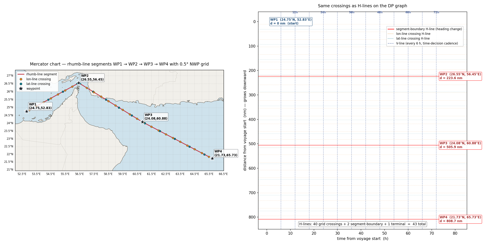

# H-Line Geographic Reconstruction — Summary

**Apr 28–29, 2026** · Persian Gulf → Strait of Malacca voyage rebuild

---

## 1. Incentive

The DP graph relies on **H-lines** (constant-distance decision boundaries) to mark every distance at which a meaningful physical change happens — segment heading shifts and weather-cell crossings. The previous implementation placed weather-cell H-lines at the **midpoint between two consecutive 12 nm interpolated waypoints** whose `(lat, lon)` fall in different 0.5° NWP cells. That's a heuristic, off by up to ±6 nm per crossing, and unrelated to where the route actually crosses the grid on a globe.

Fix: replace the midpoint heuristic with **exact analytic crossings** between the voyage's rhumb-line segments and the 0.5° NWP grid, sourced from the paper's authoritative `(lat, lon)` waypoint table.

## 2. Locked Spec — Q&A Session

| # | Question | Decision |
|---|---|---|
| Qg1 | Source for segment endpoints | (c) **Paper Table 1** — 13 explicit `(lat°, lon°)` waypoints |
| Qg2 | Path shape inside a segment | (a) **Rhumb line** (constant compass bearing) |
| Qg3 | NWP grid resolution | (a) **0.5° marine grid**, axis-aligned |
| Qg4 | Cumulative-distance metric | (a) **Rhumb-line (loxodromic) distance** |
| Qg5 | Weather lookup | (b) Per-cell aggregation — deferred to next stage |
| Qg6 | Implement immediately? | (b) **Visualise first**, then implement |
| Qg7 | Visualisation scope | WP1 → WP2 → WP3 → WP4 (sample) and full 12-segment |
| Qg8 | Map projection | (b) **Cartopy / Mercator** (rhumb lines render straight) |
| Qg9 | Robustness scope | (b) **Math + auto-projection** for arctic / antimeridian |
| Qg10 | High-lat test fixture | (a) **Iceland → Tromsø** (lat 64°→ 70°, lon −22° → 19°) |

## 3. Statistics — YAML voyage (3393.24 nm, 12 segments)

| Metric | Old (waypoint-midpoint) | New (analytic rhumb-vs-grid) |
|---|---|---|
| Total H-lines | 146 | **164** |
| Grid crossings | 134 | **152**  (95 lon + 57 lat) |
| Segment-boundary lines | 11 | 11 |
| Terminal sink line | 1 | 1 |
| Bearing accuracy vs paper β | n/a (heuristic) | **±0.2 °** per segment |
| Cumulative-distance error | n/a | **+0.36 nm** out of 3393.24 (+0.01 %) |
| Per-crossing position error | ≲ 6 nm (waypoint midpoints) | **< 1 m** (analytic) |
| Code modules added | — | `route_waypoints.py`, `geo_grid.py`, `test_routes.py`, `visualize_geo_grid.py` |

Robustness pass (Qg9 + Qg10) added: latitude clamp `|φ| ≤ 89.5°`, Δlon normalisation `(−180°, 180°]` for antimeridian routes, and a Cartopy projection auto-selector (Mercator → NorthPolarStereo / SouthPolarStereo / PlateCarree based on extent). Validated against the new Iceland → Tromsø fixture (1033 nm, 91 H-lines, lat 64°–70°N).

## 4. Visualisation

WP1 → WP2 → WP3 → WP4 — left: **Mercator chart with 0.5° NWP grid**, orange dots = lon-line crossings, teal dots = lat-line crossings, black stars = waypoints. Right: same crossings as **H-lines on the DP graph (t, d)** plane, with V-lines (blue dashed, every 6 h) marking the time-decision cadence.

