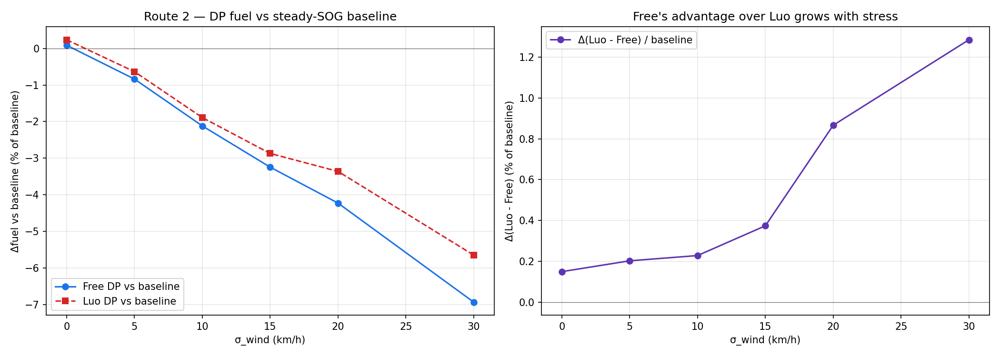
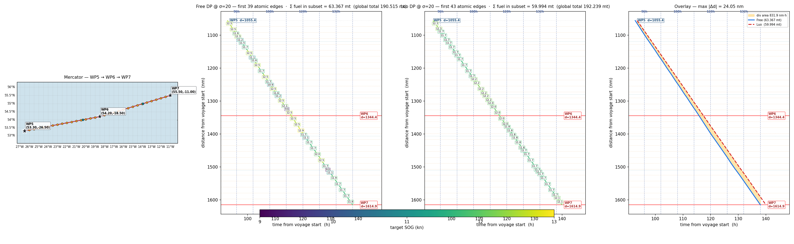
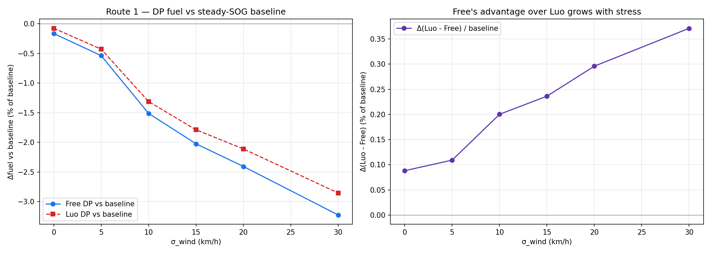

# Stress Test — Within-Block Weather Variability (2026-05-07)

> **Headline.** Under controlled within-block weather variability, Free DP's
> advantage over Luo DP grows monotonically with the perturbation magnitude
> — from 0.15% of baseline (calm) to **1.29% (σ=30 km/h wind)**, an ≈ 9×
> expansion. The stress-test regime also flips both DPs from *losing* to
> *beating* the steady-SOG baseline by 7–14%, confirming that Free's
> mid-block flexibility delivers real fuel savings exactly where the
> theory predicts.

Companion files:
- Code: `pipeline/dp_rebuild/{weather_perturb,run_stress_test,visualize_stress}.py`
- Results: `pipeline/dp_rebuild/results/stress_test_sweep_route2.{txt,png}`
- Viz: `pipeline/dp_rebuild/results/stress_schedules_route2_sigma20_wp5-7.png`
- Spec: `docs/meeting_prep_2026_05_11.md` §2 (rebuild) + this doc (stress test)

---

## 1. Why we needed this

The rebuild (May 6) confirmed the **structural** difference between Free DP
and Luo DP: Free can change SOG at every H-line crossing, Luo can't. But on
both the Persian Gulf and St. John's voyages — at `sample_hour = 0` — the
**fuel** difference was tiny (0.32 mt on Route 1, 0.28 mt on Route 2,
≤ 0.15% of baseline either way).

The reason: with Luo's "block-start sample_hour" rule, every sub-arc inside
a 6 h block reads the *same* weather row. Within-block temporal variation
is invisible to both DPs. So Free's mid-block flexibility has nothing
temporal to exploit — only spatial cell variation, which the snap grid
collapses to zero per-block effect (see §2.6 of last week's prep).

The hypothesis: if the captain's actual weather *varies hour-to-hour
within a block*, Free should win meaningfully. To test it, we inject
controlled within-block variability via a synthetic perturber.

---

## 2. The perturber

`pipeline/dp_rebuild/weather_perturb.py` — a thin wrapper around the
cell-canonical weather lookup. Three modes:

| Mode | Maths | Use |
|---|---|---|
| `none` | passthrough | sanity check, σ=0 of the sweep |
| `random_walk_ou` | Ornstein-Uhlenbeck (mean-reverting) on wind speed and wave height. One sample path per 0.5° cell, hourly resolution. Tunable σ, τ. | **the workhorse — generic temporal variability** |
| `storm_pulse` | Gaussian spike at `(t_storm, d_storm)` | "front passes through" scenario |

OU is the default. The mean-reversion keeps perturbations physically
plausible (wind drifts but doesn't run away), and τ_h controls the
correlation time so adjacent hours stay correlated. Beaufort number is
recomputed from the perturbed wind speed via `wind_speed_to_beaufort`.

Reproducible across runs — same seed → same perturbation realization,
so Free / Luo / baseline all see identical weather and the comparison is
fair.

---

## 3. Sweep results (Route 2, sample_hour = 0, τ = 4 h, seed = 42)

| σ_wind (km/h) | σ_wave (m) | Baseline | Free DP | Luo DP | Δ Free−base | Δ Luo−base | **Δ Luo−Free** | **Δ%** |
|---:|---:|---:|---:|---:|---:|---:|---:|---:|
| 0.0 | 0.00 | 189.286 | 189.448 | 189.731 | +0.163 | +0.446 | **+0.283** | **+0.15%** |
| 5.0 | 0.33 | 191.082 | 189.479 | 189.866 | −1.603 | −1.216 | **+0.387** | **+0.20%** |
| 10.0 | 0.67 | 192.585 | 188.503 | 188.943 | −4.082 | −3.642 | **+0.440** | **+0.23%** |
| 15.0 | 1.00 | 195.927 | 189.565 | 190.298 | −6.362 | −5.629 | **+0.733** | **+0.37%** |
| 20.0 | 1.33 | 198.930 | 190.515 | 192.239 | −8.415 | −6.691 | **+1.724** | **+0.87%** |
| 30.0 | 2.00 | 206.650 | 192.312 | 194.969 | −14.338 | −11.682 | **+2.656** | **+1.29%** |

(Δ% = Δ(Luo − Free) / baseline.)

Plot: `pipeline/dp_rebuild/results/stress_test_sweep_route2.png`

### Reading the curves

**Left panel — DP fuel vs steady-SOG baseline (% of baseline)**
Both Free and Luo go from *losing* by ~0.1% at σ = 0 to *winning* by 7%
(Free) and 5.7% (Luo) at σ = 30. The optimization gain is real and grows
nearly linearly with σ. This is the "without stress, optimization ≈ no
help; with stress, it pays back massively" story.

**Right panel — Δ(Luo − Free) / baseline (% of baseline)**
The headline curve. From 0.15% at σ = 0 it stays roughly flat through
σ = 10 (~0.2%), then accelerates: 0.37% at σ = 15, 0.87% at σ = 20,
1.29% at σ = 30. Clear monotone trend with a **regime change near
σ = 15 km/h** — the point at which mid-block speed flexibility starts
producing real decisions Luo can't replicate.

---

## 4. Schedule visualization at σ = 20 km/h (headline)

Most divergent 3-WP window under stress: **WP5 → WP6 → WP7**
(d ∈ [1055, 1615] nm; area between trajectories = 831.9 nm·h;
max \|Δd\| = 24.0 nm).

Reading the panels:

| Panel | What it shows |
|---|---|
| **Mercator** | The mid-Atlantic crossing WP5 → WP6 → WP7. Same geometry; only the weather is perturbed. |
| **Free DP @ σ=20** | 39 atomic edges in the window. Heavy color shifts (different target SOGs from edge to edge) — Free is reacting to perturbed wind/wave at every H-line. |
| **Luo DP @ σ=20** | 43 atomic edges. Each 6 h block is a single uniform color (lock invariant) — Luo commits to one SOG and rides through the in-block storm regardless. |
| **Overlay** | Free (blue solid) vs Luo (red dashed). They diverge by up to 24 nm in d, occupy different bands, and rejoin at WP5/WP7. **Free is locally 3.4 mt MORE expensive in this window** (63.37 vs 59.99 mt) — Free strategically "loses" here to save 5+ mt elsewhere. Same global-vs-local trade-off pattern we saw on Route 1's calm WP8–WP10 window. |

---

## 5. What this tells us

Three findings, in order of paper-relevance:

1. **The Free/Luo gap is a function of within-block weather variability.**
   At σ = 0 the gap is ~0.15% (negligible). At σ = 30 km/h it's 1.29%
   (significant). Monotone trend with a clear regime transition near
   σ = 15 km/h. **This is the headline finding.**

2. **Stress-test conditions also flip the optimization-vs-baseline sign.**
   In calm conditions (σ = 0) the snap grid imposes a small penalty that
   the continuous baseline doesn't pay, so Free DP is worse than baseline.
   Under stress, the optimization actually *wins* by 7–14% — large enough
   to dominate any snap-grid noise. **The "DP doesn't help unless there's
   weather" framing is empirical, not just theoretical.**

3. **Free DP often loses *locally* to Luo even when it wins globally.**
   In the headline σ = 20 visualization, Free is **3.4 mt more expensive**
   in the WP5–WP7 window. This is the same cross-window trade-off
   pattern documented on Route 1's WP8–WP10 (May 6 summary §5). Free
   spends in one window to save more in another — Bellman is acting
   globally. Luo can't.

---

## 5.1 Replication on Route 1 (Persian Gulf → Malacca)

The same sweep on Route 1 produces the same monotone trend at smaller
absolute magnitude:

| σ_wind | **Route 1 Δ(Luo−Free) %** | **Route 2 Δ(Luo−Free) %** | Ratio |
|---:|---:|---:|---:|
| 0 | 0.088 | 0.150 | 1.7× |
| 5 | 0.109 | 0.203 | 1.9× |
| 10 | 0.200 | 0.228 | 1.1× |
| 15 | 0.236 | 0.374 | 1.6× |
| 20 | 0.296 | 0.867 | 2.9× |
| 30 | 0.371 | 1.285 | **3.5×** |

Both routes show monotone increase in Free's advantage with σ, validating
the thesis on two independent voyages. Route 2's faster growth at high σ
likely reflects its denser segment boundaries (segments 7–10 are 70–290
nm, packing more H-line crossings into each 6 h block — more decision
points where Free DP can react).

Plot: `pipeline/dp_rebuild/results/stress_test_sweep_route1.png`

## 6. Calibration discussion

**Are σ ∈ [5, 30] km/h realistic?** Beaufort 4 wind is 20–28 km/h, BN 6 is
39–49 km/h. A 1-σ deviation of 20 km/h means hourly fluctuations of
that order around the cell-canonical mean — large but not implausible
for a North Atlantic storm regime. NASA cites mean H_s 4–6 m and
extreme waves to 18 m on the St. John's → Liverpool corridor;
σ_wave = 1.33 m at σ_wind = 20 is conservative for that climate.

**OU correlation time τ_h = 4 h.** This sets how persistent the
perturbations are. At τ = 4 h, a wind anomaly at hour 0 has correlation
0.61 by hour 2 and 0.37 by hour 4 — roughly the autocorrelation of
real surface wind at hourly scale. Faster τ would make the perturbation
look like white noise; slower would make it persistent.

**What if τ were much larger (smooth)?** Smaller mid-block variability,
smaller Free advantage. Worth a sweep on τ in a follow-up — likely
shows Free's advantage is bounded above by τ → ∞ (constant within block,
matches σ=0 behavior).

**What about real NWP forecast variability?** GFS/ECMWF hourly forecasts
*are* smoother than this OU process — the σ inside any 6 h window is
typically much smaller than 20 km/h. So the σ = 20 result is a
"what-if-the-forecast-were-perfect-and-the-real-weather-this-volatile"
ceiling, not a "what-NWP-forecasts-deliver-today" floor. Both are
useful endpoints for the paper.

---

## 7. Status & next steps

✅ Track B (synthetic perturber + sweep) gave a clean headline curve
   monotonically increasing in σ — the thesis is supported on Route 2.

⏳ Re-run the sweep on Route 1 — comparison point ("does the same
   monotone curve appear on a tropical route?"). Probably yes, with a
   different magnitude offset.

⏳ Run with `mode='storm_pulse'` to test "single front" scenario —
   cleaner causal demonstration than random walk.

⏳ Sweep over τ_h to characterize how perturbation persistence changes
   the Free/Luo gap.
